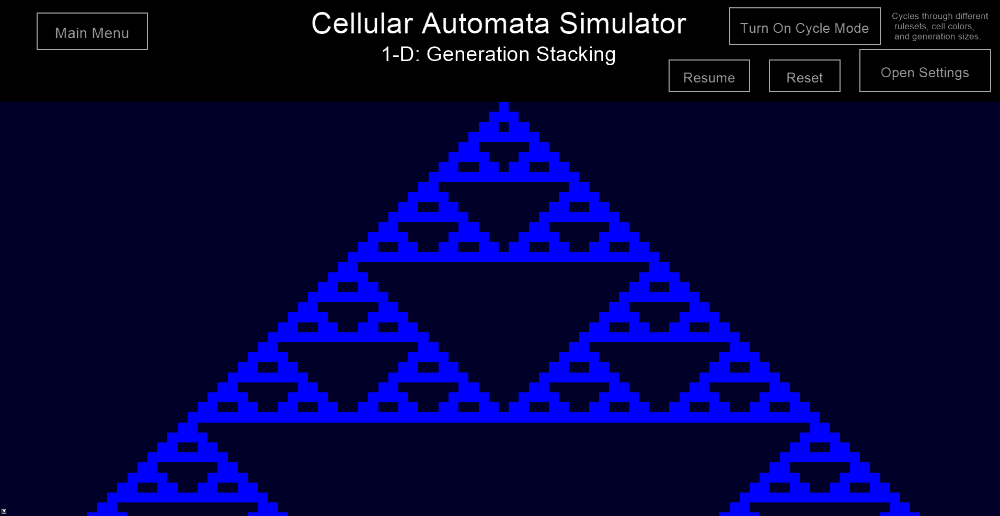

# Cellular Automata Simulator
## Explore the world of cellular automata with a customizable simulation of cells that evolve immense complexity based on a finite set of simple rules through both 1-D Generation Stacking and 2-D Game of Life.

### What You Can Do:

#### 1-D Generation Stacking (https://mathworld.wolfram.com/ElementaryCellularAutomaton.html)
- Select a ruleset between 0 and 255
- Select a starting generation (default, random, or alternating)
- Set colors for live cells and dead cells, respectively
- Set the number of cells per generations (less cells = each cell is larger and rendering is faster, more cells = each cell is smaller and rendering is slower)
- Pause and/or resume the simulation at any time
- Reset the simulation at any time
- Activate Cycle Mode to see the simulation cycle through different rulesets, colors, and numbers of cells per generation automatically

#### 2-D Game of Life (https://en.wikipedia.org/wiki/Conway%27s_Game_of_Life)
- Select a starting board (default, random, or empty)
- Set colors for live cells and dead cells, respectively
- Set the number of cells per row of the board (less cells = each cell is larger and rendering is faster, more cells = each cell is smaller and rendering is slower)
- Pause and/or resume the simulation at any time
- Reset the simulation at any time
- Activate Cycle Mode to see the simulation cycle through different colors and numbers of cells per row automatically
- Left click to revive dead cells, right click to kill live cells at any time during the simulation

### How To Run The Program:

#### Windows:
- Download Visual Studio Community 2015 with Update 3 at https://my.visualstudio.com/Downloads?q=visual%20studio%202015&wt.mc_id=o~msft~vscom~older-downloads
- When downloading, select custom installation and check the box for "Common Tools for Visual C++ 2015"
- Download Cinder for Visual C++ 2015 at https://libcinder.org/download
- Once these are both downloaded, open this repository in a code editor that supports CMake, build the project, and then run it

##### Note: This program does not support MacOS, Linux, or Mobile.
